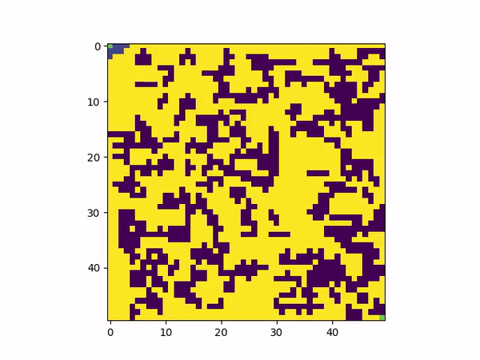
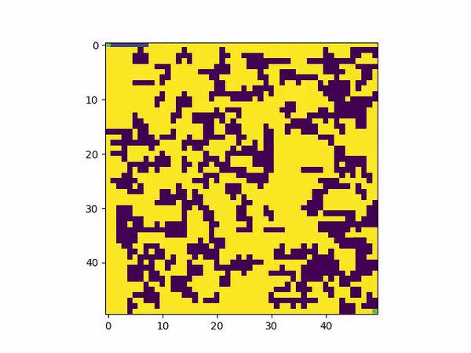

# Assignment 2 - Flatland


## Usage Guidelines

### Astar

1. Open 'Astar' folder in zipped file and run: -

    ```
    python3 Astar.py
    ```

    > Please note: - Currently **Grid with 35% obstacle density is already loaded (128x128 grid)** 

2. `Results` 


### BFS

1. Open 'bfs' folder in zipped file and run: -

    ```
    python3 BFS.py
    ```

    > Please note: - Currently **Grid with 35% obstacle density is already loaded (128x128 grid)** 

2. `Results` conatins saved images and videos on 50x50 and 128x128 grid for different obstacle densities.



### DFS

1. Open 'dfs' folder in zipped file and run: -

    ```
    python3 dfs.py
    ```

    > Please note: - Currently **Grid with 35% obstacle density is already loaded (128x128 grid)** 

2. `Results` conatins saved images and videos on 50x50 and 128x128 grid for different obstacle densities.



### Dijkstra

1. Open 'Dijkstra' folder in zipped file and run: -

    ```
    python3 dijkstra.py
    ```

    > Please note: - Currently **Grid with 35% obstacle density is already loaded (128x128 grid)** 

2. `Results` conatins saved images and videos on 50x50 and 128x128 grid for different obstacle densities.


### Random Planner

1. Open 'Random Planner' folder in zipped file and run: -

    ```
    python3 random_planner.py
    ```

    > Please note: - Currently **Grid with 35% obstacle density is already loaded (128x128 grid)** 

2. `Results` conatins saved images and videos on 50x50 and 128x128 grid for different obstacle densities.
